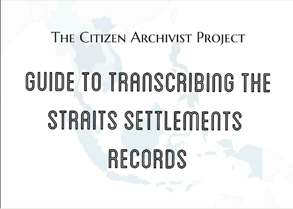

# Guide to Transcribing Straits Settlements Records

Grace Ho 3 years ago 2 min. read

***This is part of a series of posts on the Citizen Archivist Project. For more information on this crowd-sourcing platform, please see www.nas.gov.sg/citizenarchivist/.*** 

Keen to try your hand at transcribing cursive, handwritten records but daunted by inky loops spanning the entire page? Fear not, a batch of NAS interns (Abigail Chew, Angeline Lee and Sandy Wang) have crafted a guide to transcribing the Straits Settlements Records. This handy guide will accompany you as you embark on your transcribing journey at The Citizen Archivist Project!

Set up in 2015, [the Citizen Archivist Project ](http://www.nas.gov.sg/citizenarchivist/) is a portal by NAS that harnesses the power of crowdsourcing by allowing the public to pool together their collective knowledge and broaden Singapore’s history. This is done through transcribing old records and audio reels, as well as describing photographs of the past.

The largest collection on the Citizen Archivist Project are documents from the Straits Settlement Records (SSR) for [transcribing ](http://www.nas.gov.sg/citizenarchivist/Documents). The SSR is an extensive collection of documents that date back to the British administration of the Straits Settlements comprising Singapore, Penang and Malaysia from 1826 to 1946. Given the complex cursive and inky pages weathered away by time and the elements, these documents cannot be read well by computers. Instead, dedicated Citizen Archivist transcribers are better at deciphering the handwriting. NAS hopes to transcribe as many Straits Settlement records as possible by 2019, the 200th anniversary of Sir Stamford Raffles’ landing in Singapore.

However, we understand that transcription of these handwritten documents can seem intimidating. Hopefully this guide can get you oriented to the basic terms and make it seem a less arduous task. This guide contains helpful sections such as

1. Challenging Words
2. Common Phrases and Abbreviations used in the Straits Settlements
3. Common Designations in the Straits Settlements: Official titles commonly used by the East India Company and the British Empire, accompanied by a brief description of the various responsibilities.
4. Persons of Note (i.e Governors and Resident Councillors) in the Straits Settlements: Names of important people, their titles and periods of service.
5. Terms and Expressions of the Colonial Era: Various jargon and their definitions set against the context of massive commerce and communication among different empires and native rulers.
6. Currencies Used during the Colonial Era: Most commonly mentioned currencies that were vital for trade within the Straits Settlements.
7. Units of Measurements Used during the Colonial Era: Units of Measurement in the past that differ greatly from that of the present.
8. Places of Interest in the Straits Settlements: Significant places mentioned in the Straits Settlements Records, some of which have been renamed now.
9. Alphabet Style Guide: Variations of a single letter from A-Z, with several words as examples.

Though helpful, this guide is by no means exhaustive. Drop us an email at [nas@nlb.gov.sg](mailto:nas@nlb.gov.sg) if you have any feedback to further improve this resource. For now, happy transcribing!