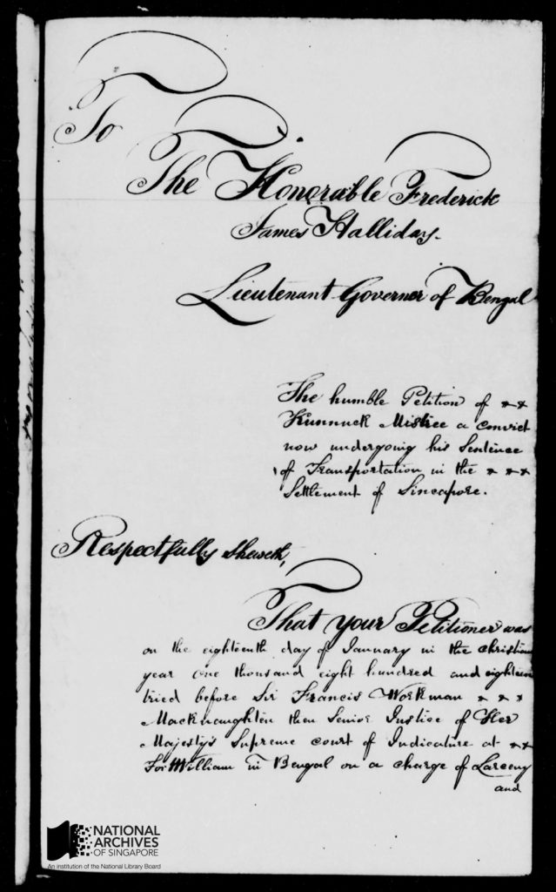
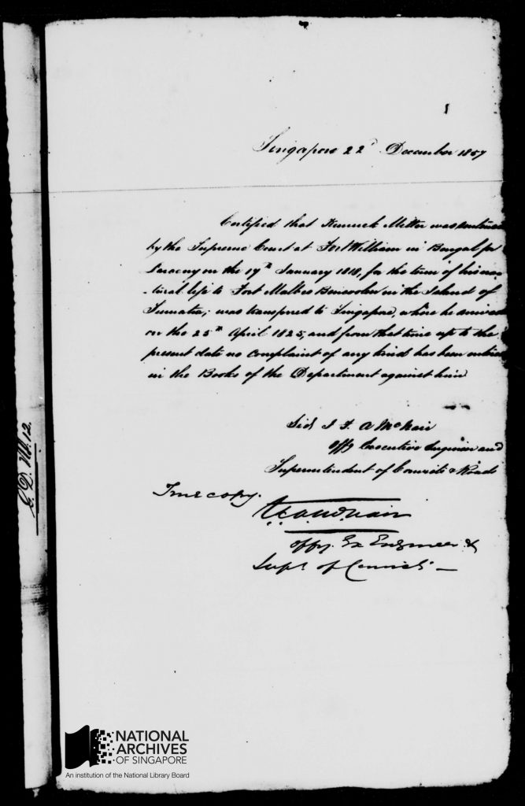

# The Mystery of Kunnuck Mistree

Grace Ho 4 years ago 8 min. read

***This is part of a series of posts on the Citizen Archivist Project. For more information on this crowd-sourcing platform, please see www.nas.gov.sg/citizenarchivist/.***

The National Archives of Singapore launched the [Citizen Archivist Project ](http://www.nas.gov.sg/citizenarchivist) in March 2015, inviting members of the public to assist in making archival records more accessible. One of our volunteer transcribers, **Ms Vandana Aggarwal**, writes about an Indian migrant, Kunnuck Mistree, whose life story captured in the records piqued her interest.

**The Mystery of Kunnuck Mistree**

While transcribing the Straits Settlements Records for the National Archives of Singapore, I stumbled across the story of a convict named Kunnuck Mistree.[[1\]](http://www.nas.gov.sg/blogs/offtherecord/the-mystery-of-kunnuck-mistree/#_ftn1) History books dealing with that period make no mention of him, yet he piqued my interest for the fascinating story that I reconstructed in my mind, from my understanding of history and the historical Straits Settlements records. After all it is not every day that one comes across repeated references to a common man, and a convict at that, in Government records!

 

The official letter of appeal sent by the lawyers of Kunnick Mistree to Frederick James Halliday, the Lieutenant Governor of Bengal, 19 July 1856. [To read the transcribed pages of the letter please visit Citizen Archivist.](http://www.nas.gov.sg/citizenarchivist/Documents/Transcribe?collectionId=44&itemId=6413#collection)

View [Kunnuck’s Original Appeal Letter](http://www.nas.gov.sg/blogs/offtherecord/wp-content/uploads/2016/07/Kunnucks-Appeal-Letter.pdf) here in full text!

**Who was Kunnuck Mistree?**                                           

The story begins in January of 1818. A young man named Kunnuck was tried by the Supreme Court located at Fort William (present day Kolkata). His crime, larceny. On his conviction he was sentenced to deportation for life to Fort Marlborough in Bencoolen, a British possession in Sumatra – a place he had probably never heard of before.

It was a time when British colonial aspirations were at their peak. The East India Company had established political and economic control over India. They were now looking to spread their wings in Southeast Asia.

Kunnuck, (his name is spelt variously as Kannuck Mistre, Kanak Mithay, Kannuck Ram Mitter etc in the records) along with other convicts, soon found himself aboard on a ship bound for Bencoolen[[2\]](http://www.nas.gov.sg/blogs/offtherecord/the-mystery-of-kunnuck-mistree/#_ftn2).

Sending criminals to the colonies in the 17th and 18th century was quite common as it filled a critical requirement for labour, especially in South East Asia.[[3\]](http://www.nas.gov.sg/blogs/offtherecord/the-mystery-of-kunnuck-mistree/#_ftn3)

It was in the same year (1818) that Sir Stamford Raffles arrived at Bencoolen, as Lieutenant Governor. One of his first acts was to abolish slavery. Hence there was a pressing need for convict labour to take on the tasks of clearing forests, building roads and buildings etc.

It is difficult to establish if Kunnuck was a habitual or professional criminal. Later events and what we know of them, negates this idea.

Kunnuck however was employed at the Convict establishment at Fort Marlborough, as a dresser at the Convict Hospital. He must have impressed his officers, as the Superintendent of Convicts there certifies that, “Cunnuck Mithre Convict of 1st Class has uniformly behaved himself well, and has always manifested example of good conduct.” [[4\]](http://www.nas.gov.sg/blogs/offtherecord/the-mystery-of-kunnuck-mistree/#_ftn4)

Writing in 1827, the Head Surgeon of the General Hospital at Fort Marlborough records that he always found “Kunnuck Ram Mitter…….diligent and attentive.” [[5\]](http://www.nas.gov.sg/blogs/offtherecord/the-mystery-of-kunnuck-mistree/#_ftn5)

**The Move to Singapore**          

With the signing of the Anglo-Dutch Treaty in 1824, the Factory of Fort Marlborough and the English possessions on the Island of Sumatra were ceded to Netherlands. The treaty also authorized the removal of convicts from Bencoolen to other British colonies.

In a petition Kunnuck’s solicitor notes that the, “… petitioner finding himself comfortable and happy in his then position neglected to avail himself of a conditional pardon accepted by other convicts and was consequently removed to Sincapore …”[[6\]](http://www.nas.gov.sg/blogs/offtherecord/the-mystery-of-kunnuck-mistree/#_ftn6)

Why Kunnuck chose not to seek a pardon is a mystery. To live in a faraway land where the language, food, religion and culture were alien to him must have been hard. But Kunnuck made the best of his circumstances.

He arrived in Singapore on 25th April 1825, with the second batch of convicts to have landed in Singapore from Bencoolen. [[7\]](http://www.nas.gov.sg/blogs/offtherecord/the-mystery-of-kunnuck-mistree/#_ftn7)

Once again Kunnuck took up the job of a dresser at the convict/pauper hospital. Apart from a fleeting mention of a Rs 2 addition to his salary in 1828,[[8\]](http://www.nas.gov.sg/blogs/offtherecord/the-mystery-of-kunnuck-mistree/#_ftn8) we have no information about his life in Singapore for the following two decades.

Finally after 21 years of service, in September 1846, he applied for a Ticket of Leave which was granted to him. He was allowed to live in any part of the island and to practise any trade that he wished. He had to however attend muster at the Department of Convicts at stated times.[[9\]](http://www.nas.gov.sg/blogs/offtherecord/the-mystery-of-kunnuck-mistree/#_ftn9)

The Ticket of Leave had been introduced in keeping with Raffles vision of 1818 where, “In cases of particular good conduct, a prospect may be held out of emancipation of deserving convicts from further obligation of service, on condition of their supporting themselves and not quitting the settlement,”[[10\]](http://www.nas.gov.sg/blogs/offtherecord/the-mystery-of-kunnuck-mistree/#_ftn10)

Kunnuck had been a convict for 28 years (1818-1846) and was undoubtedly getting on in years. It is a mystery why he did not ask to return to India at this point.

Asad Latif in his book, ‘India in the making of Singapore’ referring to Indian life convicts pardoned in 1867 notes, “Some of those pardoned unconditionally returned to India, but that country was no longer their ‘piece of work’: they could not recognize themselves there.” For convicts, returning to India was very often a difficult decision to make, as they feared losing caste status having travelled overseas.

From 1846 onwards Kunnuck busied himself as a native holistic doctor, specialising in traditional Indian medicine. Several pages in the Straits Settlements records constitute character certificates from doctors and prison wardens who came in contact with him. They are glowing in their words of praise for his behaviour and the fact that they had, “heard nothing unfavourable of him,”[[11\]](http://www.nas.gov.sg/blogs/offtherecord/the-mystery-of-kunnuck-mistree/#_ftn11) and that he was, “diligent and attentive.”[[12\]](http://www.nas.gov.sg/blogs/offtherecord/the-mystery-of-kunnuck-mistree/#_ftn12)

**The call of the Ganges**

It was in 1856, by which time Kunnuck was probably around 70 years of age, he petitioned that he be allowed to return home. He had been away from his homeland for upwards of 38 years. In his final years he wanted to die in his country of birth, on the banks of the River Ganges that Hindus hold so sacred. [[13\]](http://www.nas.gov.sg/blogs/offtherecord/the-mystery-of-kunnuck-mistree/#_ftn13)

Letter dated 22 Dec 1857 from J.F. McNair, Superintendent of Convicts & Roads for the Straits Settlements, verifying Kunnuck’s life story and certifying his good behaviour since being transferred to Singapore in Apr 1825. [To read the transcribed pages of the letter please visit Citizen Archivist. ](http://www.nas.gov.sg/citizenarchivist/Documents/Transcribe?itemId=6405&collectionId=44)

 

It was not until three years later that a letter dated 20th January 1858 was finally received from Fort William, stating that, Kunnuck was free to retire to his native country. [[14\]](http://www.nas.gov.sg/blogs/offtherecord/the-mystery-of-kunnuck-mistree/#_ftn14)

It was rare for life convicts to be pardoned, but it was not unheard of, especially if they had served for a very long period with an exemplary track record. It speaks volumes for Kunnuck Mistree’s hard work, honesty and strength of character that the British Government allowed him to return.

Just before leaving he transferred over his land for religious purposes.[[15\]](http://www.nas.gov.sg/blogs/offtherecord/the-mystery-of-kunnuck-mistree/#_ftn15)  Since he was a Hindu it is quite probable that he gave it to a Hindu temple. Temples played an important role in the lives of convicts as they became a place for congregation with fellow countrymen, giving them a sense of community in an alien land and helping them fulfil their religious obligations. Kunnuck in his last duty towards a country, that had been his home for nearly 40 years, gave away his possessions to the community.

Considering Kunnuck was around 70 years of age in 1856 he must have been born around 1786, and been about 32 years of age when he was convicted and sent overseas as indentured labour. Convicts were not allowed to marry hence legally he couldn’t raise a family in the Straits Settlement. What became of his family in India? Did he meet them when he returned to India? There are still many unanswered questions. Maybe someday we will find out more about Kunnuck and reconstruct more of his story.

Kunnuck would have been a forgotten episode in our colonial history. However thanks to the SSR he will no longer remain one of the many faceless convicts who spent their lives far away from their homelands, toiling in the hot sun and helping in their own small way to build this island that we are so proud of today.

**The Citizen Archivist Project**

The National Archives of Singapore launched the [Citizen Archivist Project ](http://www.nas.gov.sg/citizenarchivist) in March 2015, inviting members of the public to assist in making archival records more accessible by transcribing handwritten documents and describing photographs. The documents, mostly from the Straits Settlements records, provide valuable insight into the growth of Singapore in the 1800s. Even though these may be “government administrative records”, there are many interesting accounts of people and places to be found.

**Endnotes**

[[1\]](http://www.nas.gov.sg/blogs/offtherecord/the-mystery-of-kunnuck-mistree/#_ftnref1) [SSR – S 26: Vol I/II: Governor’s Letters from Bengal. SSR- S026_00750](http://www.nas.gov.sg/citizenarchivist/Documents/Transcribe?itemId=6413&collectionId=44) Official letter of appeal sent by the convict spells his name as Kunnuck Mistree.

[[2\]](http://www.nas.gov.sg/blogs/offtherecord/the-mystery-of-kunnuck-mistree/#_ftnref2) Modern day Bengkulu

[[3\]](http://www.nas.gov.sg/blogs/offtherecord/the-mystery-of-kunnuck-mistree/#_ftnref3) Anand Yang, “Indian Convict Workers in South East Asia in the Late Eighteenth and Early Nineteenth Centuries,” Journal of World History 14, No 2. ( Fall 2003), 179-208

[[4\]](http://www.nas.gov.sg/blogs/offtherecord/the-mystery-of-kunnuck-mistree/#_ftnref4) [SSR – S 26: Vol I/II: Governor’s Letters from Bengal. S026_00870](http://www.nas.gov.sg/citizenarchivist/Documents/Transcribe?itemId=6425&collectionId=44)

[[5\]](http://www.nas.gov.sg/blogs/offtherecord/the-mystery-of-kunnuck-mistree/#_ftnref5) [SSR – S 26: Vol I/II: Governor’s Letters from Bengal. S026_00690-00691](http://www.nas.gov.sg/citizenarchivist/Documents/Transcribe?collectionId=44&itemId=6407#collection)

[[6\]](http://www.nas.gov.sg/blogs/offtherecord/the-mystery-of-kunnuck-mistree/#_ftnref6) [SSR – S 26: Vol I/II: Governor’s Letters from Bengal.  S026_00770](http://www.nas.gov.sg/citizenarchivist/Documents/Transcribe?collectionId=44&itemId=6415#collection)

[[7\]](http://www.nas.gov.sg/blogs/offtherecord/the-mystery-of-kunnuck-mistree/#_ftnref7) Prisoners their own warders: a record of the convict prison at Singapore in the Straits Settlements, established 1825, discontinued 1873, together with a cursory history of the convict establishment at Bencoolen, Penang and Malacca from the year 1797 By Major J.R.A. McNair

[[8\]](http://www.nas.gov.sg/blogs/offtherecord/the-mystery-of-kunnuck-mistree/#_ftnref8) [SSR – S 26: Vol I/II: Governor’s Letters from Bengal.  Q002_00750](http://www.nas.gov.sg/citizenarchivist/Documents/Transcribe?itemId=22061&collectionId=102)

[[9\]](http://www.nas.gov.sg/blogs/offtherecord/the-mystery-of-kunnuck-mistree/#_ftnref9) [SSR – S 26: Vol I/II: Governor’s Letters from Bengal.  S026_00780](http://www.nas.gov.sg/citizenarchivist/Documents/Transcribe?collectionId=44&itemId=6416#collection)

[[10\]](http://www.nas.gov.sg/blogs/offtherecord/the-mystery-of-kunnuck-mistree/#_ftnref10) Memoir of the Life and Public Services Of Sir Thomas Stamford Raffles, Particularly in the Government of Java, 1811-1816, And of Bencoolen and Its Dependencies, 1817-1824-  Edited by his Widow. Sophia Raffles

[[11\]](http://www.nas.gov.sg/blogs/offtherecord/the-mystery-of-kunnuck-mistree/#_ftnref11) [SSR – S 26: Vol I/II: Governor’s Letters from Bengal.  S026_00850](http://www.nas.gov.sg/citizenarchivist/Documents/Transcribe?collectionId=44&itemId=6423#collection)

[[12\]](http://www.nas.gov.sg/blogs/offtherecord/the-mystery-of-kunnuck-mistree/#_ftnref12) [SSR – S 26: Vol I/II: Governor’s Letters from Bengal.  S026_00820](http://www.nas.gov.sg/citizenarchivist/Documents/Transcribe?collectionId=44&itemId=6420#collection)

[[13\]](http://www.nas.gov.sg/blogs/offtherecord/the-mystery-of-kunnuck-mistree/#_ftnref13) [SSR – S 26: Vol I/II: Governor’s Letters from Bengal.  S026_00790](http://www.nas.gov.sg/citizenarchivist/Documents/Transcribe?collectionId=44&itemId=6417#collection)

[[14\]](http://www.nas.gov.sg/blogs/offtherecord/the-mystery-of-kunnuck-mistree/#_ftnref14) [SSR – S 26: Vol I/II: Governor’s Letters from Bengal.  S026_00640](http://www.nas.gov.sg/citizenarchivist/Documents/Transcribe?collectionId=44&itemId=6402#collection)

[[15\]](http://www.nas.gov.sg/blogs/offtherecord/the-mystery-of-kunnuck-mistree/#_ftnref15) [SSR – Z 36: Singapore: Letters from Governor.  Z036_00240](http://www.nas.gov.sg/citizenarchivist/Documents/Transcribe?itemId=15680&collectionId=71)

