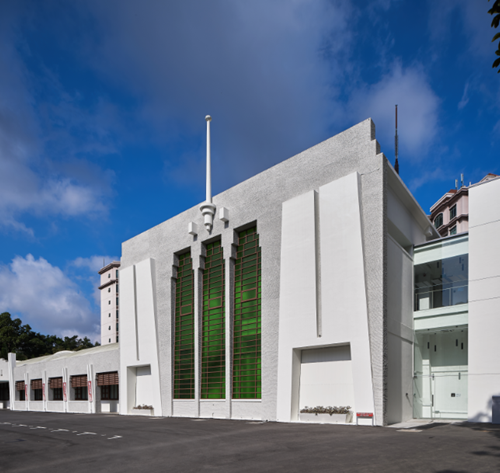
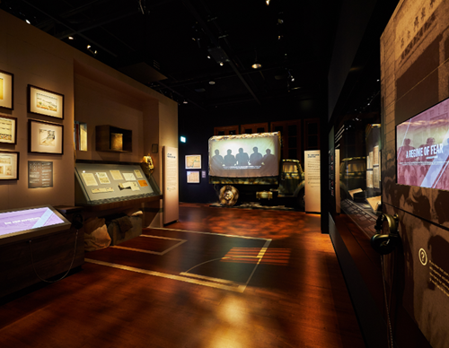
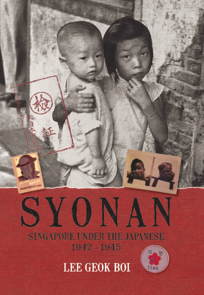

# Memories of War and its Legacies

Fiona Tan 2 years ago 4 min. read

In 1992, the Singapore Heritage Society, with the support of partners including the National Archives, Oral History Department (now the Oral History Centre) and the National Museum, published *Syonan : Singapore Under the Japanese Occupation 1942-1945*, written by Lee Geok Boi, to commemorate the 50th anniversary of the Fall of Singapore. A key source for the book was the Japanese Occupation project –  one of the first oral history interview  projects carried out by the Oral History Department when it was established  in September 1979. Compared to the military campaign and fall of Singapore to the Japanese, there had been little by way of documentation the daily lives of those who had lived through the Occupation. It was with this in mind that the OHC sought to fill in this gap almost four decades later. The original Japanese Occupation project lasted four and a half years (June 1981 to December 1985). 179 persons were interviewed, totaling 719.5 recorded hours of interviews.[[1\]](http://www.nas.gov.sg/blogs/offtherecord/memories-of-war-and-its-legacies/#_ftn1)

 

​					Facade of the Former Ford Factory, 2017. Courtesy of National Archives of Singapore.

In 2003, the National Archives of Singapore (NAS) was offered the Former Ford Factory site (the historic location where Lieutenant-General Arthur Ernest Percival, the British General Officer Commanding Malaya, surrendered to Lieutenant-General Yamashita Tomoyuki, the Japanese Commander of the 25th Army on 15 February 1942) for its new archives repository, and to develop a permanent exhibition to showcase the events and the lives of people surrounding the Japanese Occupation. This became Memories at Old Ford Factory (MOFF),  which housed a World War Two Interpretative Gallery which  presented oral history accounts collected by NAS together with photographs, documents and archival materials from NAS’ collection and overseas archives institutions.

More than 300,000 visitors passed through MOFF since its opening by then- Defence Minister Teo Chee Hean on 16 February 2006. MOFF has played an important national role in educating citizens and visitors on the indelible mark left by the Occupation on our national psyche.

​			Interior shot of the revamped exhibiton in 2017. Courtesy of National Archives of Singapore.

The government felt that a revamp of MOFF was timely to refresh the exhibits and storyline.  The revamp was also occasioned, in part, by key changes in our society and consciousness – not least, the awakening of interest in aspects of our past. This was most noticeable during the celebrations for the 50th year of Singapore’s independence in 2015. But there has been renewed interest, too, on account of the growing realization that those who lived through the Japanese Occupation are few, and those who remember its privations, ever fewer. More has to be done to commemorate this part of our history. Within a short span of time, these recollections will pass out of living remembrance. The revamp is therefore not just timely but important.

​																	Courtesy of Landmark Books.

The revision of the 1992 book (long out of print) is therefore very timely. The new edition, in an attractive hardback compact form, is a visual and narrative treat. It has been updated based on the revamped gallery’s storyline : *Surviving the Japanese Occupation : War and its Legacies*.  This new edition (as well as the gallery’s new storyline) highlight both short and long-term post-war legacies, including wartime remembrances and the impact of the War and Occupation on post-war developments, and the ways in which these developments continue to reverberate in Singapore today. In both the gallery and book, emphasis has been placed on allowing voices to speak for themselves.  Both make use of work which has been done since 1985 on oral history collection.

The hope is that both the revamped gallery and the revised book (which is also meant to commemorate the 75th anniversary of the Fall of Singapore in 2017) will not just deepen awareness of our past, but will help researchers and the public understand better NAS’ rich collection. These resources support the learning of key aspects of our history and heritage – if, as it is hoped, they are used.

Besides Ms Lee Geok Boi, who kindly agreed to update and revise her original 1992 text, the contributions from the advisory committee that was set up to guide the project team on the positioning of MOFF’s revamped storyline and content should also be noted.  The advisory committee (who also gave valuable suggestions on the updating of the book) comprised Kwa Chong Guan (Chair; Senior Fellow, S. Rajaratnam School of International Studies), Dr Paul Kratoska (Publishing Director, NUS Press), Dr Kwok Kian Woon (Associate Provost, Nanyang Technological University) and Ho Chi Tim  (Lecturer, National University of Singapore,  Department of History). The revised edition would also not have been possible without the Singapore Heritage Society’s support.

They and numerous others who helped to make the book and the revamped Gallery possible deserve Singaporeans’ sincere thanks for playing a role in ensuring that these memories will not simply be consigned to dusty textbooks. What happened in Singapore and Malaya must be remembered, and existing efforts to collect memories have to be built on, to create, and augment, lived experience.

*Written by Dr Shashi Jayakumar (Chairman, National Archives Advisory Committee)*

------

[[1\]](http://www.nas.gov.sg/blogs/offtherecord/memories-of-war-and-its-legacies/#_ftnref1) The original Japanese Occupation project continued on an ad-hoc basis, up to 2014, to make up a total of 360 interviews (1,104 hours). The additional interviews were collected both locally and overseas (the latter group includes interviews with former Prisoners-of-War , and even Japanese who fought in the war).