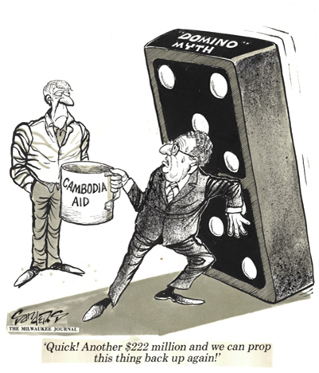

# External threats: Storm Clouds over Indochina

Fiona Tan 2 years ago 1 min. read

###### **This essay was originally published in The 2nd Decade: Nation Building In Progress 1975-1985 publication. To view the Live Notes, please click here.**

***This was published as part of a series of posts for the NS50 celebration to commemorate 50 years of National Service in Singapore.*** 

Security problems dominating the first decade had largely receded by the second decade. Bilateral ties with Indonesia steadily improved following the end of Konfrontasi in 1966. Communist insurgency, while still a risk, was under control by the mid-1970s.

However, new problems emerged. In 1975, South Vietnam, Cambodia and Laos fell to Communism, and fears grew that other Southeast Asian countries could follow like a row of falling dominos. The security situation worsened in 1978 when Vietnam invaded and occupied Cambodia with the backing of its ally the Soviet Union. Tensions remained high the following year as China fought Vietnam in a short but fierce border war in support of Cambodia.

With Vietnam and the Soviet Union asserting themselves militarily, China was drawn into the picture. In contrast, the United States (US) and Great Britain were scaling back their presence in Southeast Asia. This left the region threatened by political instability, affecting trade and foreign investments.

Domestically, falling birth rates meant fewer national servicemen for the SAF, raising concerns about the military readiness of the reservist force.

Furthermore, after a decade of growth, the SAF needed to upgrade its defence equipment to keep up with regional political changes.

The domino theory was first proposed by United States President Dwight D. Eisenhower in 1954. The theory predicted that if a country came under communist influence, the countries surrounding it would soon follow, toppling like a row of falling dominos. Milwaukee Journal, courtesy of NAS.