# Turbo-charging the armed forces

Fiona Tan 2 years ago 5 min. read

###### **This essay was originally published in The 2nd Decade: Nation Building In Progress 1975-1985 publication. To view the Live Notes, please click here.** 

***This was published as part of a series of posts for the NS50 celebration to commemorate 50 years of National Service in Singapore.*** 

The decade saw the SAF develop a substantially stronger navy and air force and make continuous enhancements to the army in its efforts to transform itself into a technologically superior armed forces.

Home grown companies like Chartered Industries of Singapore, the Singapore Shipbuilding and Engineering Company, and the Singapore Aerospace Maintenance Company developed the capability to design new weapons, like assault rifles, and manufacture and upgrade complex military hardware, including small modern warships.

> The new equipment made fuller use of Singapore’s increasingly well-educated soldiers who were able to quickly absorb the more complex training required to handle them. They also enabled the SAF to be leaner but more deadly, making up for the gradual decline in national serviceman intakes from the late 1970s due to falling birth rates. As Minister of Defence Dr Goh Keng Swee related in Parliament in August 1977:*“It is necessary to economise the use of manpower. As a result of successful family planning in past years, the number of young men available for national service in future years will show a steady but relentless decline. In 10 years time, the number available will be nearly 30 per cent less than what it is now…”**[1]***
>
> Addendum to Presidential Address by Minister of Defence Dr Goh Keng Swee at the Opening of the First Session of the Fourth Parliament on Tuesday, 8th February 1977- *Ministry of Defence. Ministry of Culture, courtesy of NAS. Ref.: bhs19770208cs.*

Apart from making improvements in hardware, the second decade saw new initiatives to attract talented Singaporeans into the armed forces. The public and professional image of the SAF was improved through public education campaigns, as well as job enhancements for SAF personnel, like better career development, overseas training opportunities, and tertiary education scholarships.

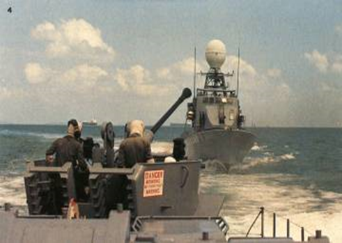

German-designed and technologically advanced, the Republic of Singapore’s missile gunboats were commissioned by the Singapore navy in 1975. They were armed with anti-ship and anti-aircraft cannons as well as electronically guided missiles. Four of the six missile gunboats were locally manufactured by the Singapore Shipbuilding and Engineering Company. *MINDEF, courtesy of NAS.*

> *“We have had National Service for 15 years now. I believe, however, that we have not yet built up a close and natural relationship between the SAF and the* *people. There is still an inadequate appreciation of the importance of SAF officers.* 
>
> *For example, our society as a whole does not accord SAF officers the esteem they deserve. A Colonel commanding a division of 15,000 men does not carry the same prestige as a doctor in social circles. Yet, the doctor’s survival, indeed, the whole country’s survival, in times of war, may depend on that Colonel and his 15,000 men.”* [[2\]](http://www.nas.gov.sg/blogs/offtherecord/turbo-charging-the-armed-forces/#_ftn2)
>
> Speech by Goh Chok Tong, Minister for Defence at the Promotion Ceremony for Reservist Officers, at Beach Road Camp on Tuesday, 29 June 1982*. Ministry of culture, courtesy of NAS. Ref.:* *gct19820629s*

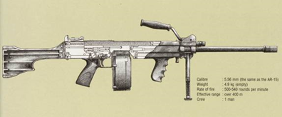

The handy and accurate Ultimax 100 light machine gun was developed by Chartered Industries of Singapore with guidance from Jim Sullivan, a renowned firearms designer who co-designed the M-16 rifle. Introduced to the SAF in 1983, it remains the lightest 5.56mm calibre machine gun in the world. *Fighting Fit-The Singapore Armed Forces*, 1990, courtesy of NAS.

 

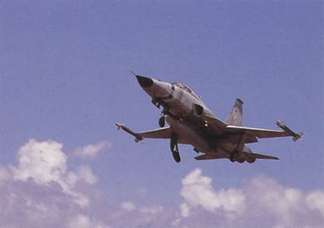

The American F-5E Tiger II, acquired in 1979, was Singapore’s first supersonic fighter aircraft *MINDEF, courtesy of NAS.*

 

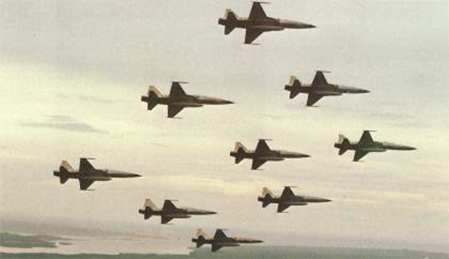

The F-5Es, flying in close formation, during Singapore’s 1980 National Day celebrations.  *MINDEF, courtesy of NAS.*

The SAF enhanced its air defences considerably in the second decade. High-tech anti-aircraft missiles were acquired, like the American Improved Hawk missile and the man-portable Swedish

 

RBS-70 missile, mounted on an SAF V200 armoured vehicle. *MINDEF, courtesy of NAS.*

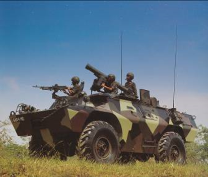

​                                                                          *MINDEF, courtesy of NAS.*

 

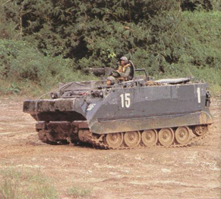

In the second decade, American M113 armoured personnel carriers were purchased to replace our ageing fleet of V200 armoured vehicles, which were redesignated for air defence. The M113 was equipped with tracks, which enhanced manoeuvrability over rough terrain. *MINDEF, courtesy of NAS.*

 

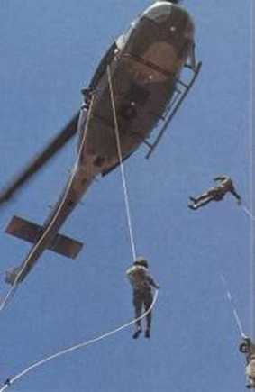

The American Bell UH-1H “Huey” helicopter was introduced to the SAF in 1977. The “Huey” was used to transport the SAF’s elite Commandos and Guardsmen, and was an integral part of early SAF efforts to develop the capacity to launch large-scale heliborne operations. *MINDEF, courtesy of NAS.*

 

#### SAF recruitment posters used in 1978.

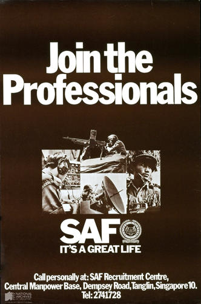

Join the professionals, SAF, it’s a great life. *Singapore Armed Forces, courtesy of National Archives of Singapore. Ref.:* [*PO0420/98*](http://www.nas.gov.sg/archivesonline/posters/record-details/305200c7-115c-11e3-83d5-0050568939ad)*.*

 

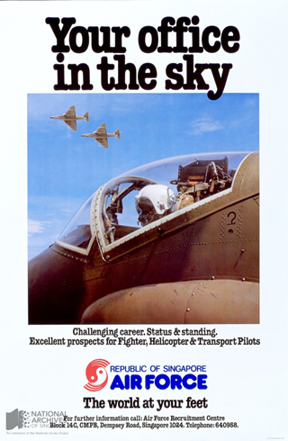

Your office in the sky. *Republic of Singapore Air Force, courtesy of NAS. Ref.: 19990003742-0024.*

 

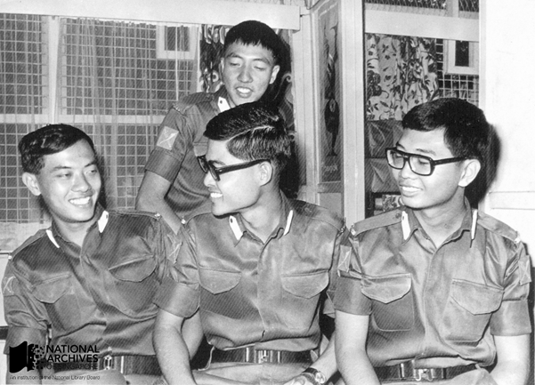

The SAF helped groom many of Singapore’s present generation of leaders. Several of our current Cabinet Ministers were SAF scholars, such as BG George Yeo (far left), RADM Teo Chee Hian (standing), and Mr Lim Hng Kiang (centre). SPH, courtesy of NAS.

 

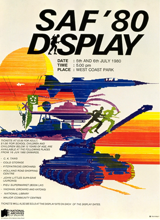

The SAF continued to engage Singaporeans through exciting public displays, showcasing its latest equipment and combat skills. *MINDEF, courtesy of NAS. Ref.: 19990005275 – 0035.*

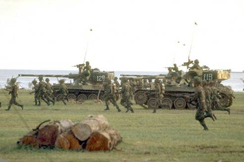

SAF Display ’83, in celebration of Armed Forces Day at West Coast Park. *Ministry of Culture, courtesy of NAS. Ref.: 19980006807.*

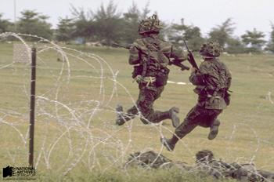

*SAF Display ’83, in celebration of Armed Forces Day, at West Coast Park. Ministry of Information, Communications and the Arts, courtesy of NAS*. [*Ref.: 19980006807.*](http://www.nas.gov.sg/archivesonline/photographs/record-details/ebff7afd-1161-11e3-83d5-0050568939ad)

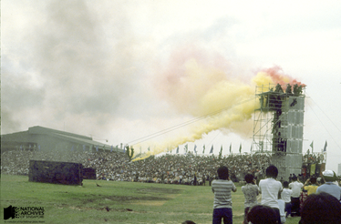

Scenes from the SAF Display, 1983. Simulated assault on enemy positions by SAF armoured (top) and infantry forces (below) as well as a demonstration of the fire fox in simulated combat conditions (below). *Ministry of Culture, courtesy of NAS. Ref.: 19980006807-0102*

 

------

[[1\]](http://www.nas.gov.sg/blogs/offtherecord/turbo-charging-the-armed-forces/#_ftnref1)  Addendum to Presidential Address by Minister of Defence Dr Goh Keng Swee at the Opening of the First Session of the Fourth Parliament on Tuesday, 8th February 1977- *Ministry of Defence. Ministry of Culture, courtesy of NAS. Ref.: bhs19770208cs* <http://www.nas.gov.sg/archivesonline/speeches/record-details/735f9183-115d-11e3-83d5-0050568939ad>

 

[[2\]](http://www.nas.gov.sg/blogs/offtherecord/turbo-charging-the-armed-forces/#_ftnref2) Speech by Goh Chok Tong, Minister for Defence at the Promotion Ceremony for Reservist Officers, at Beach Road Camp on Tuesday, 29 June 1982*. Ministry of culture, courtesy of NAS. Ref.:* [*gct19820629s*](http://www.nas.gov.sg/archivesonline/speeches/record-details/714759fb-115d-11e3-83d5-0050568939ad)

<http://www.nas.gov.sg/archivesonline/speeches/record-details/714759fb-115d-11e3-83d5-0050568939ad>