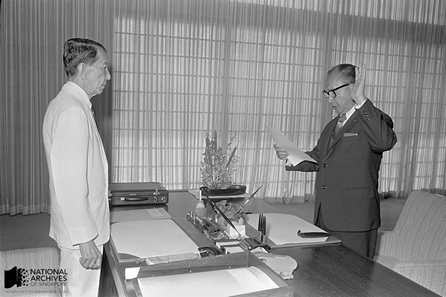
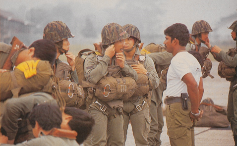
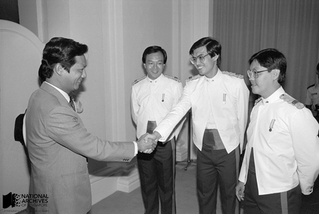
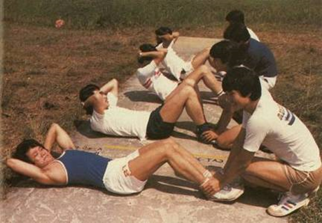
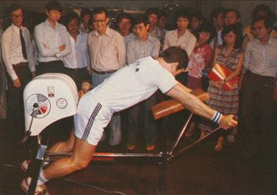
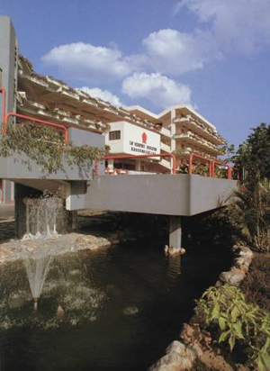
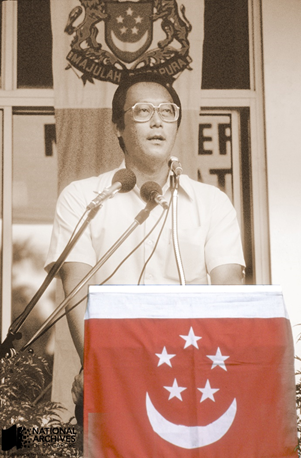
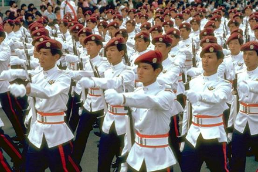

# Fit to fight: Reservists on the frontline

Fiona Tan 2 years ago 4 min. read

###### **This essay was originally published in The 2nd Decade: Nation Building In Progress 1975-1985 publication. To view the Live Notes, please click here.** 

***This was published as part of a series of posts for the NS50 celebration to commemorate 50 years of National Service in Singapore.*** 

There was also a strong focus in the second decade on improving the quality of our reservists, i.e. those Singapore citizens who had completed their full time National Service. By 1984, reservists accounted for 80 per cent of Singapore’s armed forces, or about 200,000 soldiers. Thus the effectiveness of the nation’s military depended on having fit, motivated and well-trained reservists.

Reservists were reminded that they were Singapore’s front-line military force and not a mere second-line “reserve”, and that they were counted on as defenders of the nation even as they went about their civilian lives.

In-camp training was made more vigorous and streamlined to save time and increase training intensity. Promising reservist soldiers were promoted and sent for advanced military training to upgrade their skills. The best reservist officers were selected for training at the SAF’s prestigious Command and Staff College, which previously admitted only senior career officers.

Efforts were made to improve the fitness levels of reservist soldiers, as many lost their physical conditioning after returning to civilian life. A new physical fitness test called the Individual Physical Proficiency Test (IPPT) was introduced in 1980 to ensure that reservists upkeep their physical fitness.

To raise the morale of reservists and recognise the crucial role they played in Singapore’s national defence, our Government also established the first two permanent Singapore Armed Forces Reservist Association (SAFRA) clubhouses at Toa Payoh and Bukit Merah. The clubhouses provided quality meeting places for reservists to meet up with one another and were generously furnished with first class sport and gym facilities to encourage physical fitness.

Second Minister for Defence Howe Yoon Chong swearing in before President Benjamin Sheares in 1979. Mr Howe initiated SAF reforms in the second decade to improve reservist fitness, training and morale. *Ministry of Culture, courtesy of NAS.*

> *“The fate of the nation depends on every soldier playing his part* *and bearing his responsibility as a citizen. National defence is a* *heavy responsibility. We have been given the duty to defend our country. If members of the SAF, both in active and in reserve units, take their training and tasks seriously, others will have second* *thoughts about threatening Singapore, and peace will be preserved.* *If we do not take our training and tasks seriously, we will be inviting others to take our possessions away by force…*
>
> *Singaporeans must be made aware of the improvements in quality continually being made in the SAF. In order to win the respect of the public, in particular, of those who are national servicemen or reservists, our regular corps of soldiers must impress them with a sense of commitment to their profession and to the country.”**[1]***
>  Extract from message by Minister of Defence Goh Chok Tong on SAF Day, 1 July 1982. *Ministry of Culture, courtesy of NAS. Ref.: gct19820701s*.

Reservist Commandos from the 10 Commando Battalion preparing for a parachute jump.  To maintain the effectiveness of the SAF, training was made more strenuous for reservists in the second decade.  *Pioneer, courtesy of NAS.*

Minister for Information and Communications and Second Minister for Defence Dr Yeo Ning Hong congratulating officers from the Reservist Officers Staff Training Course at their graduation ceremony at the Istana, 1985. *Ministry of Culture, courtesy of NAS.*

Reservists taking the IPPT fitness test. The test was medically designed to check a soldier’s strength, agility and endurance and comprised of five exercises – pull-ups, sit-ups, shuttle-run, standing broad jump and a 2.4 km endurance run. When it was first introduced, soldiers had to take the test every six months and pass it, or face a remedial training programme. *Pioneer, courtesy of NAS.*

The SAFRA Bukit Merah clubhouse established in 1982 was attractively designed and furnished with the latest fitness equipment to encourage reservists to exercise regularly and keep fit. *Pioneer, courtesy of NAS.*

​                                      *Fighting Fit – The Singapore Armed Forces, 1990, courtesy of NAS.*

 

The Republic’s third Minister for Defence Goh Chok Tong took over the defence portfolio from Mr Howe Yoon Chong in 1982. *Ministry of Culture, courtesy of NAS.*

​                       Elite SAF Commandos on parade during National Day 1982. *Pioneer*, *courtesy of NAS.*

 

------

[[1\]](http://www.nas.gov.sg/blogs/offtherecord/fit-to-fight-reservists-on-the-frontline/#_ftnref1)Extract from message by Minister of Defence Goh Chok Tong on SAF Day, 1 July 1982. *Ministry of Culture, courtesy of NAS.  Ref.: gct19820701s*.