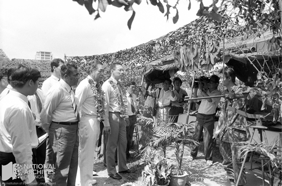
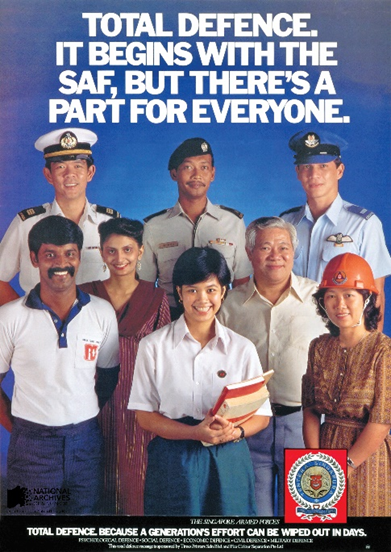
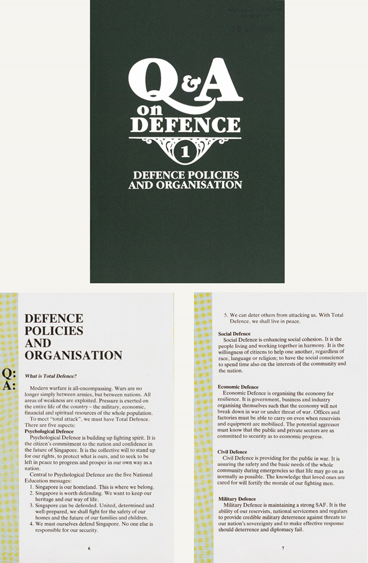
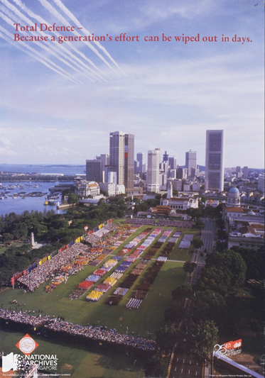

# Total Defence

Fiona Tan 2 years ago 2 min. read

###### **This essay was originally published in The 2nd Decade: Nation Building In Progress 1975-1985 publication. To view the Live Notes, please click here.**

***This was published as part of a series of posts for the NS50 celebration to commemorate 50 years of National Service in Singapore.*** 

​															*MINDEF, courtesy of NAS.*

 

> *“Defence cannot just be the responsibility of the government or the armed forces. It is the responsibility of the whole nation….National will is thus an essential political recondition of any convincing military posture of deterrence. Singaporeans must be psychologically prepared to defend our homeland. Thus even if a hostile ship from a big power comes steaming in with a huge banner across its bow saying, ‘Singapore here we come”, we must* *still try and be prepared to blow it up. At least, we must extract a high price from our aggressors.”**[1]***
>
> Extract of by Minister of Defence and Second Minister Goh Chok Tong at the graduation ceremony of SAF non-commissioned officers at Pasir Laba Camp, 1984. *Ministry of Culture, courtesy of NAS. Ref.: gct19840327s*

 

The concept of Total Defence, which remains at the centre of Singapore’s defence planning today, was introduced in 1984. It was designed to integrate all segments of Singapore society into a united front for the defence of the country by expanding public understanding of national defence beyond military defence.

Minister of State for Defence and Trade and Industry Brigadier-General (Res) Lee Hsien Loong and Speaker of Parliament Dr Yeoh Ghim Seng at Total Defence Exhibition at Bedok North Secondary School during opening of Total Defence-Student Seminar.  *Ministry of Culture (MICA), courtesy of NAS*. [*Ref.: 19980006025 –* 0024](http://www.nas.gov.sg/archivesonline/photographs/record-details/25c2e182-1162-11e3-83d5-0050568939ad)

Total Defence addressed the modern reality that warfare was not confined to armed military personal but involved every aspect of society, which were as much at risk from enemy attack as soldiers were. It also highlighted that the defence and continued prosperity of Singapore was dependent on the joint-effort of all Singaporeans, not only active military personal or civil servants.

Total defence, it begins with the SAF, but there’s part for everyone. *MINDEF, courtesy of NAS. Ref.: 19990005287-0001*

​																		*MINDEF, courtesy of NAS.*

​																	*MINDEF, Courtesy of NAS*

> *“National preparedness is the most effective way of deterring threats and maintaining peace. Should deterrence fail, our preparedness will enable us to respond effectively and decisively. Our way of life will only be guaranteed by our will to safeguard it, coupled with the ability to do so.”*
>
> Speech by Second Minister of Defence Dr Yeo Ning Hong at the Tri-service Graduation Ceremony at Pasir Laba Camp, 9 March 1985.[[2\]](http://www.nas.gov.sg/blogs/offtherecord/total-defence/#_ftn2)

 

------

[[1\]](http://www.nas.gov.sg/blogs/offtherecord/total-defence/#_ftnref1) Speech by Mr Goh Chok Tong, Minister of Defence and Second Minister for Health at the graduation ceremony at Pasir Laba Camp on Tuesday 27 March 1984. *Ministry of Culture, courtesy of* 

*NAS. Ref.: gct19840327s*

<http://www.nas.gov.sg/archivesonline/speeches/record-details/71a726b8-115d-11e3-83d5-0050568939ad>

[[2\]](http://www.nas.gov.sg/blogs/offtherecord/total-defence/#_ftnref2) *The 2nd decade: nation building in progress 1975-1985*. (Singapore: National Archives of Singapore, 2010), p. 63.

