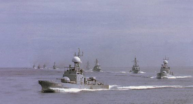
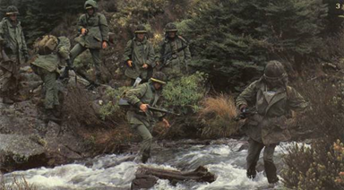
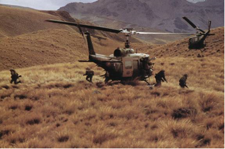
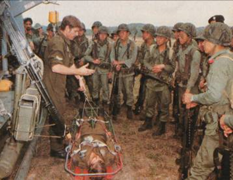
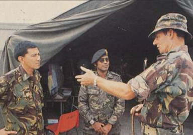
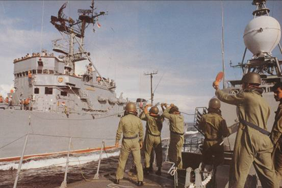
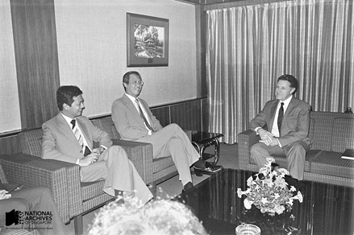
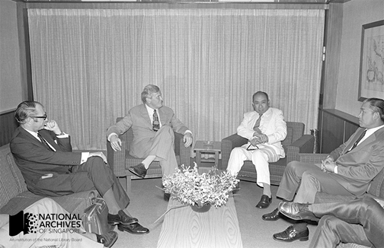

# Friendly forces: Strengthening regional defence

Fiona Tan 2 years ago 4 min. read

###### **This essay was originally published in The 2nd Decade: Nation Building In Progress 1975-1985 publication. To view the Live Notes, please click here.**

***This was published as part of a series of posts for the NS50 celebration to commemorate 50 years of National Service in Singapore.*** 

To find shared solutions to the security threat posed by Vietnam and the Soviet Union, Singapore deepened its defence relations with both fellow ASEAN nations and friendly countries with trade and strategic links with the region, such as Australia, New Zealand and the US. It also found an unexpected new friend in China.

Singapore continued its active participation in the Five Power Defence Arrangement (FPDA), its formal military alliance with Australia, Malaysia, New Zealand and Great Britain. We also signed a Treaty of Amity and Cooperation in 1976 with fellow ASEAN member-states. While not a military agreement, the Treaty was ratified in response to the turmoil in Indochina, demonstrating ASEAN’s unity in the face of external threats.

The frequency of bilateral military exercises with friendly neighbouring countries was stepped up. Numerous bilateral exercises were carried out between the SAF and the armed forces of Thailand, Indonesia, Brunei, New Zealand and Australia. Joint military exercises also took place with Malaysia and the US.

Singapore warships participating in Exercise Starfish, a FPDA joint-exercise, 1982. *Pioneer, courtesy of NAS.*

> *“Our problem of adjusting to this world is to learn how we can anticipate shifts in the power balance…..This is our dilemma – a dilemma which will concern us in more and more parts of the world. A multi-polar world theoretically means a diffusion of power centres. In reality it makes for greater anxiety because nobody is in total control…..A stalemate is best for us – a stalemate which leaves us more years in which to consolidate our security, increase our cooperation and widen our options to choose our partners in economic development and progress.”**[1]***
>
> Extract of keynote speech by PM Lee on the agenda item “World Political Scene” at the Commonwealth Heads of Government meeting in Lusaka, 1 August 1979. *Ministry of Culture, courtesy of NAS. Ref.: lky19790801*

​                                                                        *Pioneer, courtesy of NAS.*

SAF soldiers participating in a joint military exercise with the Royal Australian Armed Forces in Northern Australia, 1982 (both). *Pioneer, courtesy of NAS.*

 

Singapore troops briefed by Australian soldiers on how to conduct helicopter evacuations during Exercise Platypus, an FPDA exercise held in Australia, 1981. *Pioneer, courtesy of NAS.*

Senior commanders from Brunei (right and left) and Singapore (centre) exchanging views during Exercise Singa-Hutan, a joint exercise between the armed forces of Singapore and Brunei, conducted in Brunei, 1984. *Pioneer, courtesy of NAS.*

Sailors from the Indonesian Destroyer Escort KRI Samadikun (on left) transferring equipment to their Singaporean compatriots on the missile gunboat RSS Sea Dragon (right) during Exercise Eagle IV, 1983, a joint exercise between the Indonesian and Singapore navies. *Pioneer, courtesy of NAS.*

Top level meetings were regularly conducted between our leaders and foreign dignitaries on Southeast Asian regional security. These included talks between PM Lee and US Presidents Gerald Ford and Ronald Reagan, and landmark discussions between PM Lee and the Chinese leader Deng Xiaoping. The talks resulted in substantial improvements to Singapore’s security relations with the US and China.

Singapore’s defence diplomacy in the second decade encouraged trust, cooperation and cohesiveness between Singapore and ASEAN as well as its international allies. It served to isolate and deter potential aggressors, and was a key pillar of Singapore’s national defence.

US Secretary of Defence Caspar Weinberger (right) meeting Minister for Defence Goh Chok Tong (centre) and Minister of State for Defence Dr Yeo Ning Hong (left) during his visit to Singapore in 1982. Singapore developed close defence relations with the US in the second decade. *Ministry of Culture (now MICA), courtesy of NAS*.

 

Deputy Prime Minister and Minister of Defence Dr Goh Keng Swee (centre-right) meeting with New Zealand Deputy Prime Minister and Minister for Foreign Affairs Brian Edward Talboys (centre-left) in Singapore, 1976. Singapore maintained close defence ties with New Zealand and Australia in the second decade. Dr Goh was Singapore’s first Minister of Defence and held the Singapore’s defence portfolio from 1967 until he was succeeded by Mr Howe Yoon Chong in 1979.  The foundations of the SAF were established under Dr Goh’s leadership. *Ministry of Culture, courtesy of NAS*.

 

------

[[1\]](http://www.nas.gov.sg/blogs/offtherecord/friendly-forces-strengthening-regional-defence/#_ftnref1) Extract of keynote speech by PM Lee on the agenda item “World Political Scene” at the Commonwealth Heads of Government meeting in Lusaka, 1 August 1979. *Ministry of Culture, courtesy of NAS. Ref.: lky19790801*

<http://www.nas.gov.sg/archivesonline/speeches/record-details/732a11b8-115d-11e3-83d5-0050568939ad>