# Defending Our Sovereignty

Fiona Tan 2 years ago 8 min. read

###### *This essay was originally published in 10 Years That Shaped A Nation publication.

***This was published as part of a series of posts for the NS50 celebration to commemorate 50 years of National Service in Singapore.*** 

> *“Without the defence capability that NS made possible, Singapore* *may not have survived – let alone prospered…More than anything* *else, it is the spirit and commitment of our NS men that makes the* *SAF a potent and credible fighting force.”*
>
> Extract of speech by Prime Minister Lee Hsien Loong at the ‘40 Years of National Service Commemoration Dinner’ at Pasir Laba, camp. *Ministry of Information, Communications* *and the Arts, courtesy of NAS. Ref.: 20070927975**[1]***

Singapore’s security after independence remained uncertain and vulnerable, without its own police and military forces. Barely a year ago, in July 1964, the island experienced the worst race riots that lasted 13 days. Bombs planted by foreign militant groups as part of a long drawn battle against Singapore’s merger with Malaysia exploded in several public places in early 1965 – the most severe incident took place in the carpark of MacDonald House, which killed three and injured 33 people.

To re-establish public confidence, the immediate task of the young Republic was to build up its defence system. Minister of Defence, Dr Goh Keng Swee, established the Ministry of Interior and Defence (MID) which later became the Ministry of Defence and the Ministry of Home Affairs. With a small population, the quality of its armed forces was important. In MM Lee’s *Memoirs*, he recalled that Singapore first sought help from Egypt, India and Israel to build up its armed forces. Israel responded and provided military advice over a period of almost ten years. Under Dr Goh’s leadership, the Republic rapidly established its own air force and navy.

 

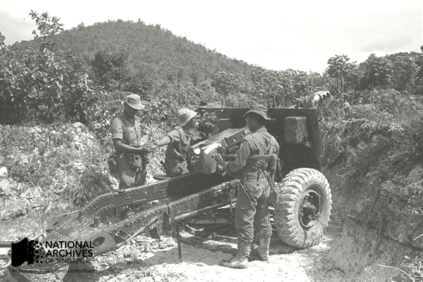

PDF artillery exercise at Pasir Laba on 24 November 1966. *Ministry of Information, Communications and the Arts, courtesy of NAS*. Ref.: [*19980005290 – 0089*](http://www.nas.gov.sg/archivesonline/photographs/record-details/c8b2d13b-1161-11e3-83d5-0050568939ad)

Immediately after Independence in 1965, Singapore’s military forces consisted of the First and Second Singapore Infantry Regiment (1 SIR and 2 SIR), the Vigilante Corps and the Singapore Volunteer Corps. In October that year, there was another recruitment drive for more volunteers to form the People’s Defence Force (PDF). By the end of the year, more than 3,000 Singaporeans had signed up.[[2\]](http://www.nas.gov.sg/blogs/offtherecord/defending-our-sovereignty/#_ftn2)

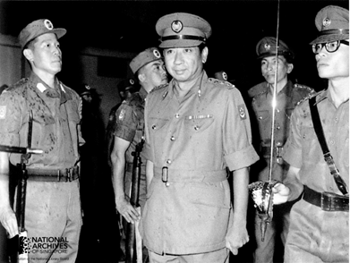

Dr Goh inspecting the second batch of PDF volunteers, which included Minister for Labour, Jek Yeun Thong (on the left), 29 November 1966. *The Straits Times, courtesy of NAS.*

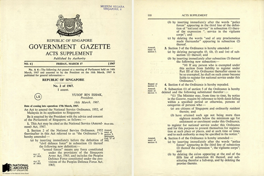

National Service (Amendment) Act came into force on 17 March 1967. Singapore Government Gazette, 1967, courtesy of NAS.

Full-time National Service (NS) was introduced in March 1967 to conscript male citizens into military service. Beyond defence, NS was seen to play an important role in nation-building.

Dr Goh’s defence strategy was to establish a small force of regulars to command conscripted NSmen. NSmen would be assigned to the reservist forces after their completion of service.[[3\]](http://www.nas.gov.sg/blogs/offtherecord/defending-our-sovereignty/#_ftn3)

> “*There is another aspect to our defence effort. This is a contribution it* *can make to nation-building… Nothing creates loyalty and national consciousness more speedily and more thoroughly than participation in defence and membership of the armed forces.*”[[4\]](http://www.nas.gov.sg/blogs/offtherecord/defending-our-sovereignty/#_ftn4)
>
> Speech by Dr Goh Keng Swee on the National Service (Amendment) Act, 1967.
>
> *Ministry of Culture, courtesy of NAS. Ref.: PressR19670313b.*

 

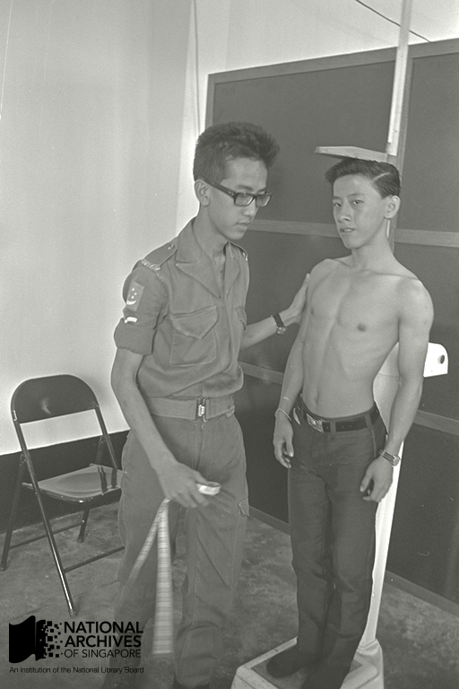

Ministry of Information, Communications and the Arts, courtesy of NAS.

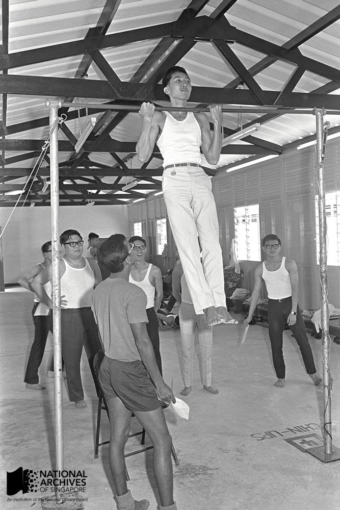

Ministry of Information, Communications and the Arts, courtesy of NAS.

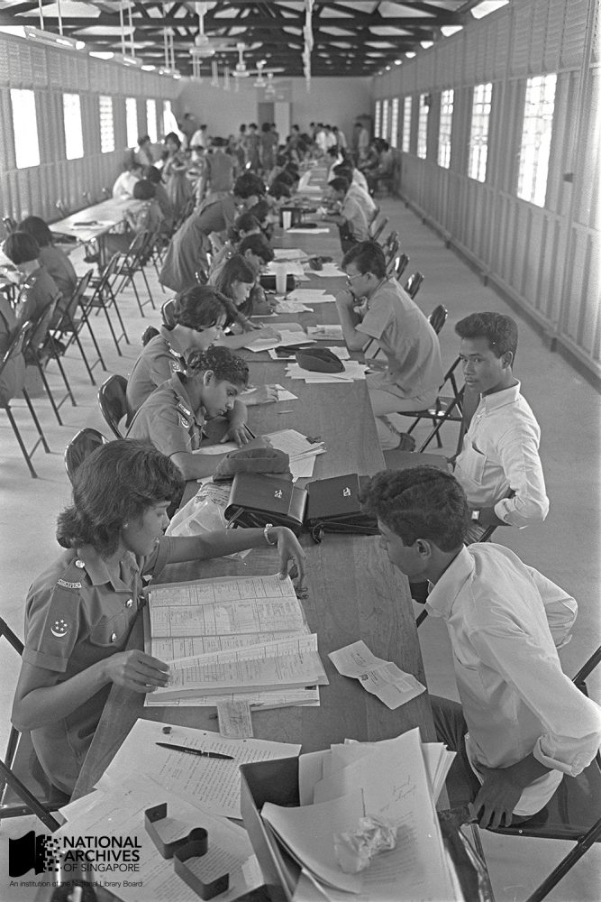

Ministry of Information, Communications and the Arts, courtesy of NAS.

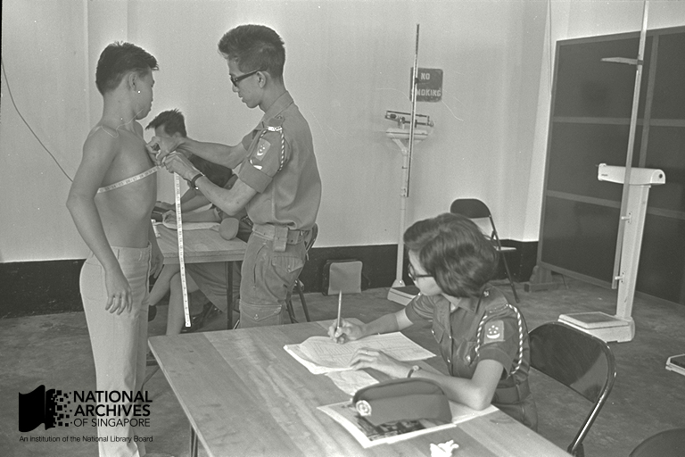Ministry of Information, Communications and the Arts, courtesy of NAS.

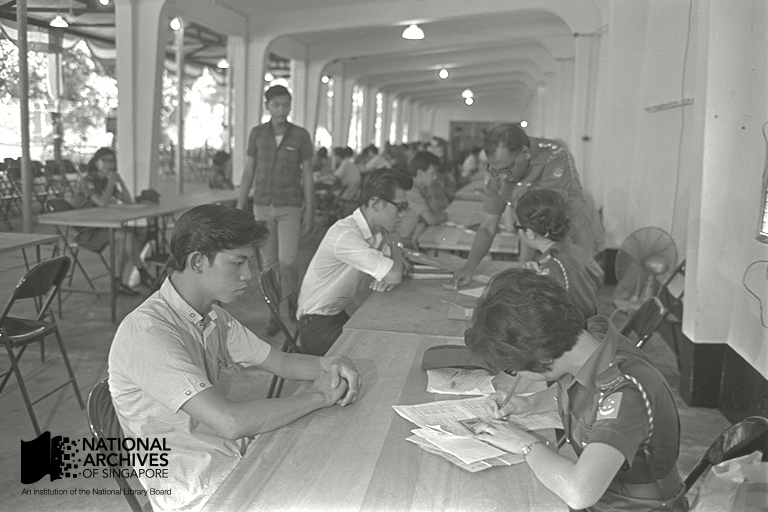Ministry of Information, Communications and the Arts, courtesy of NAS.

Registration exercise of first batch of National Service recruits – 29 March to 18 April 1967. Of the 9,428 men eligible for NS, over 96% registered.[[5\]](http://www.nas.gov.sg/blogs/offtherecord/defending-our-sovereignty/#_ftn5) *Ministry of Information, Communications and the Arts**, courtesy of NAS. Ref.: 19980005330-0037.*

 

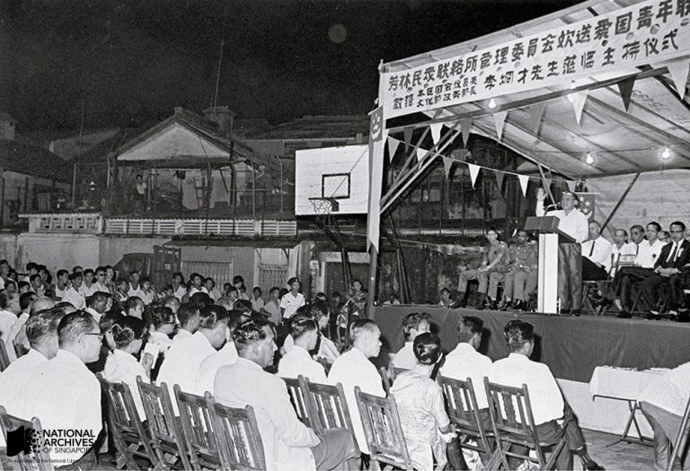Minister of State for Culture and MP for Hong Lim, Lee Khoon Choy, hosting a send-off party for NS recruits on 31 August 1967. This was one of the many send-off parties organised by the different constituencies. *Ministry of Information, Communications and the Arts, courtesy of NAS.*

 

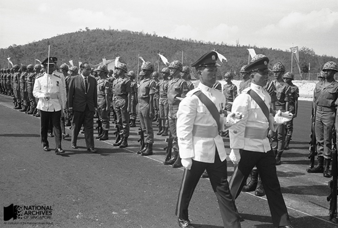

Minister of The Interior and Defence Dr Goh Keng Swee Inspecting Contingents at Singapore Armed Forces Training Institute (Safti) Commissioning Parade at Pasir Laba, Jurong, 16 July 1967. *Ministry of Information and the Arts, courtesy of NAS.* [Ref.: 19980005381-0009.](http://www.nas.gov.sg/archivesonline/photographs/record-details/caaa3115-1161-11e3-83d5-0050568939a)

 

Singapore Armed Forces Training Institute (SAFTI), the first training institute to train officer cadets, was set up as part of Dr Goh’s strategy to have a lean but high quality armed forces. After the opening of SAFTI, other military training schools set up in swift succession, like the School of Basic Military Training, School of Artillery, and the School of Signals, to provide Singapore’s soldiers with advanced training in the methods, weapons, craft, and philosophies of war needed to achieve military dominance in battle.[[6\]](http://www.nas.gov.sg/blogs/offtherecord/defending-our-sovereignty/#_ftn6)

 

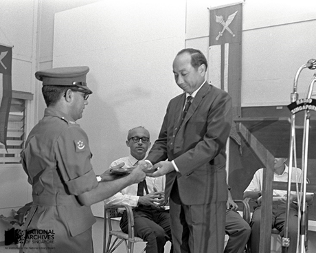

Dr Goh at the opening of the School of Artillery at SAFTI on 1 August 1967. *Ministry of Information, Communications and the Arts, courtesy of NAS. Ref.: 19980005392-0113.*

 

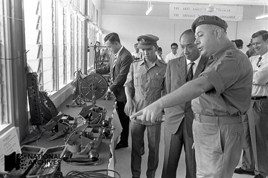

Dr Goh viewing exhibits at the opening of the School of Signals at SAFTI on 22 July 1967. *Ministry of Information, Communications and the Arts, courtesy of NAS. Ref.: 19980005384-0018.*

 

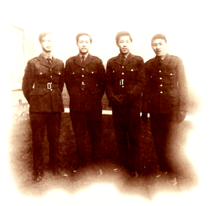

Four Air Force technicians sent to France for training on the Alouette helicopter in 1968. To strengthen air defence, the French-trained Alouette Helicopter Squadron was formed in October 1969. In less than three months, 16 Strikemaster jet aircrafts were ready for deployment.[[7\]](http://www.nas.gov.sg/blogs/offtherecord/defending-our-sovereignty/#_ftn7) *SAF and 30 Years of National Service, courtesy of NAS.*

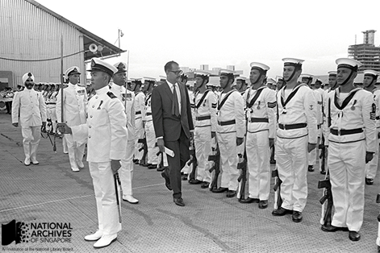

Inspection of Singapore Navy at Telok Ayer Basin by Permanent Secretary of Defence George Bogaars on 5 May 1967. After establishing land defence, the Republic rapidly built up its air and sea forces. The School of Naval Training formed in November 1968 and Pulau Brani Naval Base was set up within the next three years.[[8\]](http://www.nas.gov.sg/blogs/offtherecord/defending-our-sovereignty/#_ftn8) *Ministry of Information, Communications and the Arts, courtesy of NAS. Ref.: 19980005347- 0005.*

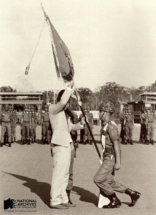

PM Lee Kuan Yew presenting SAFTI its colours, the first in SAF, two days before its second anniversary in 1968. *The Straits Times, courtesy of NAS.*

To give the Republic’s small armed forces a technological edge, Dr Goh initiated the modernisation of its weaponry. In 1972, an Electronic Test Centre (the precursor of the Defence Science Organisation) was established to develop electronic warfare and cryptography.

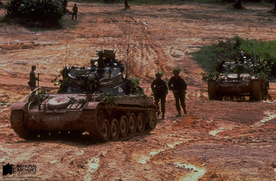

Armoured Infantry Training with Singapore Armed Forces’ AMX-13 Tanks. *Ministry of the Information and the Arts, courtesy of NAS. Ref.: 19980006289-0104*

 

> *“This small group of men… must be men of great quality. By that, I don’t mean just qualities of the mind because for this job, it is the character, the mettle in a person which determines whether the men you lead have… the confidence, the verve which is only possible, given dedicated and inspired leadership.*”
>
> Speech by Mr Lee Kuan Yew to Singapore’s first batch of officer trainees, describing the spirit and aspirations expected of SAFTI officers, 1966.

Efforts in defence and foreign relations finally came together as “defence diplomacy”, laying the ground for the first ever Five Power Defence Arrangements (FPDA) signed in 1971 between Singapore, Australia, Britain, Malaysia and New Zealand. The FPDA allowed member countries to conduct a wide variety of shared military activities, such as the Integrated Air Defence System (IADS) and annual joint military exercises.

To meet the changing security needs, Singapore continues to develop and refine its defence and foreign policies beyond the founding years, but the principles set by Dr Goh and Mr S Rajaratnam still form the foundation of today’s strategy. Total Defence – which involves not just Military Defence, but also Civil Defence, Economic Defence, Social Defence and Psychological Defence – provides the framework for a comprehensive, well-integrated response to deal with all potential threats against Singapore.[[9\]](http://www.nas.gov.sg/blogs/offtherecord/defending-our-sovereignty/#_ftn9)

In today’s geopolitical arena, Singapore continues to uphold this legacy of defence, striving to enhance our peace and security through deterrence and diplomacy.

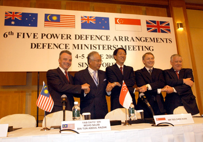

FPDA Defence Ministers at the 6th FPDA Defence Ministers’ Meeting in Singapore on 4 – 5 June 2006. The ministers reaffirmed the important role of the FPDA in regional security, as more joint and complex exercises were being conducted. The meeting highlighted FPDA’s increased focus in countering terrorism and non-conventional threats in the region.[[10\]](http://www.nas.gov.sg/blogs/offtherecord/defending-our-sovereignty/#_ftn10) *Pioneer Magazine, MINDEF Public Affairs, courtesy of NAS.*

 

> *“Where a small state is strategically situated, as Singapore is, it is important that it should maintain adequate defence forces. It goes without saying that the real security, which we want, can be found not by our unaided efforts alone, but in alliance with others. In the long term, Singapore should work towards the establishment of some kind of regional defence arrangement, possibly within a larger international framework.” **[11]***
>
> Extract of a Parliamentary Speech by Dr Goh Keng Swee on the National Service (Amendment) Act, 1967.
>
> *Ministry of Culture, courtesy of NAS. Ref.: PressR19670313b.*
>
>  

------

[[1\]](http://www.nas.gov.sg/blogs/offtherecord/defending-our-sovereignty/#_ftnref1) Extract of speech by Prime Minister Lee Hsien Loong at the ’40 Years of National Service Commemoration Dinner’ at Pasir Laba Camp, 27 Sep 2007. *Ministry of Information, Communications* *and the Arts, courtesy of NAS. Ref.: 20070927975.*

<http://www.nas.gov.sg/archivesonline/speeches/record-details/7f5a7043-115d-11e3-83d5-0050568939ad>

[[2\]](http://www.nas.gov.sg/blogs/offtherecord/defending-our-sovereignty/#_ftnref2) *Shoulder to Shoulder: Our National Service Journal*.

[[3\]](http://www.nas.gov.sg/blogs/offtherecord/defending-our-sovereignty/#_ftnref3) ‘Fighting Fit’*: The Singapore Armed Forces*, pp. 38-39.

[[4\]](http://www.nas.gov.sg/blogs/offtherecord/defending-our-sovereignty/#_ftnref4)Parliamentary Speech by Dr Goh Keng Swee on the National Service (Amendment) Act, 1967.

*Ministry of Culture, courtesy of NAS. Ref.: PressR19670313b.* 

<http://www.nas.gov.sg/archivesonline/speeches/record-details/79b11d3f-115d-11e3-83d5-0050568939ad>

[[5\]](http://www.nas.gov.sg/blogs/offtherecord/defending-our-sovereignty/#_ftnref5) *Shoulder to Shoulder: Our National Service Journal*.

[[6\]](http://www.nas.gov.sg/blogs/offtherecord/defending-our-sovereignty/#_ftnref6) ‘Fighting Fit’ : *The Singapore Armed Forces*, p. 38.

[[7\]](http://www.nas.gov.sg/blogs/offtherecord/defending-our-sovereignty/#_ftnref7) *The Air Force*, p. 18.

[[8\]](http://www.nas.gov.sg/blogs/offtherecord/defending-our-sovereignty/#_ftnref8) *Navy: The Vital Force*, p. 32.

[[9\]](http://www.nas.gov.sg/blogs/offtherecord/defending-our-sovereignty/#_ftnref9) *Ministry of Defence Singapore Website*, <http://www.totaldefence.sg/imindef/mindef_websites/topics/totaldefence/about_td.html>

[[10\]](http://www.nas.gov.sg/blogs/offtherecord/defending-our-sovereignty/#_ftnref10) *Ministry of Defence Singapore Website*,

<http://www.mindef.gov.sg/imindef/news_and_events/nr/2006/jun/05jun06_nr.html>

[[11\]](http://www.nas.gov.sg/blogs/offtherecord/defending-our-sovereignty/#_ftnref11) Parliamentary Speech by Dr Goh Keng Swee on the National Service (Amendment) Act, 1967.

*Ministry of Culture, courtesy of NAS. Ref.: PressR19670313b.* 

<http://www.nas.gov.sg/archivesonline/speeches/record-details/79b11d3f-115d-11e3-83d5-0050568939ad>