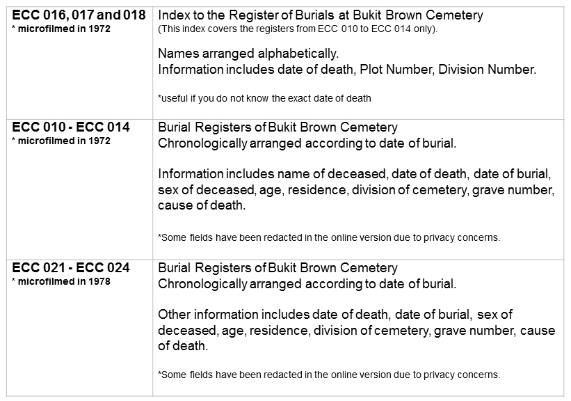
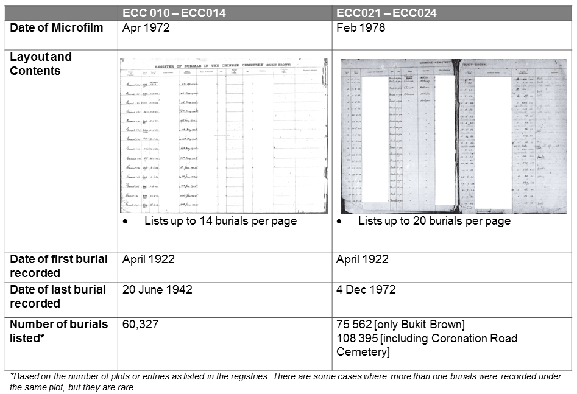
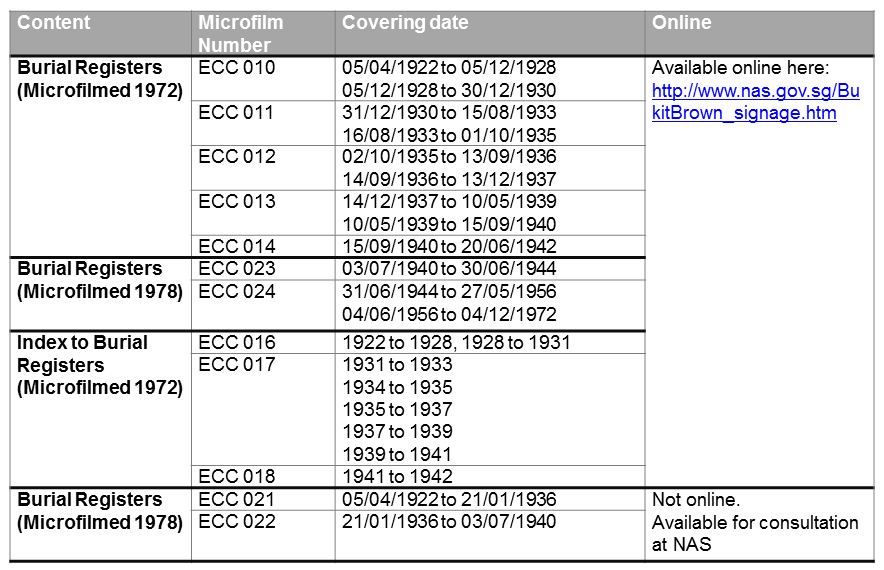

# The Bukit Brown Cemetery Burial Registers 1922 – 1972

Fiona Tan 3 years ago 1 min. read

*This is a post contributed by a private researcher, Ms Khoo Ee Hoon, who shares her knowledge about the Bukit Brown Burial Registers which she has been consulting for her private genealogical research.*

###### Tip 1: Start with the index

There are two main types of records under this series: one is the burial registers with the individual names, arranged chronologically by burial dates and the other is the index to the burial registers, with the names arranged alphabetically. Burial registers are very useful for genealogical research, but sometimes researchers may not know the person’s date of death. In such cases, the indexes are very useful.

###### **Tip 2: There are two sets of Bukit Brown Burial registers**

There are two sets of burial registers transferred from the Public Health Department and microfilmed respectively in 1972 and 1978. The 1978 is an extended version of 1972 and includes burials recorded up to 4 Dec 1972. So don’t forget to try the 1978 version if you don’t find what you are looking for in the 1972 version! The differences between the two are outlined below :

###### **Tip 3: Some have been placed online**

For those who wish to conduct genealogical research, or to search for plot location of their ancestors, the Bukit Brown Cemetery Burial Registers dating from April 1922 up till December 1972 have been digitised and uploaded online (http://www.nas.gov.sg/bukitbrown_signage.htm). To protect the privacy of the family members, two columns have been concealed; the cause of death and the last address. Below is a summary of the items NAS has made available online:

