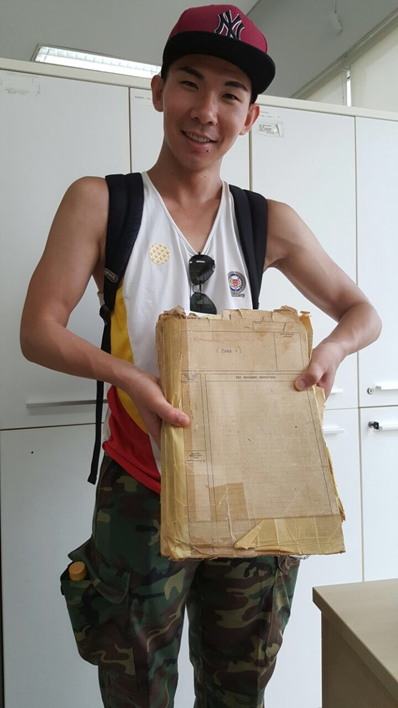
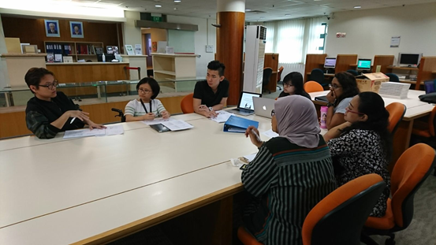
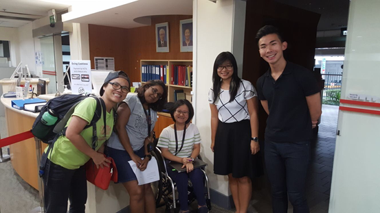

# Interns Reflections – Lim Hui Xiang

Fiona Tan 2 years ago 4 min. read

Interns Reflections is a series of posts by our interns, recounting their experience with National Archives of Singapore. From deciphering manuscript handwriting, to poring over listings and records, to heading out into the field to conduct oral history interviews, our interns have the chance to go behind the scenes to see the multi-varied nature of archival work. Interested in joining us? Email us at nas@nlb.gov.sg!

Kickstarting our Interns Reflections series are our summer interns for 2017, [Mandy Lee](http://www.nas.gov.sg/blogs/offtherecord/interns-reflections-mandy-lee/) and Lim Hui Xiang.

### Internship at the National Archives of Singapore (NAS)

Picture 1. Photograph of headstones in the now-defunct Kopi Sua Cemetery—a former private Chinese cemetery located at Mount Pleasant, accessible through Bukit Brown Municipal Chinese Cemetery. Source: Author.

 

I’ve had a fruitful 10 weeks internship—from 15 May to 14 July 2017—at the National Archives of Singapore (NAS), where I was primarily tasked to organise the death-related records into a guidebook for future and fellow NAS researchers. The second project was to contribute to the Citizen Archivist Project, where Raffles-related records were selected for transcription—in anticipation for the 200th anniversary of Raffles’ founding of Singapore in 2019.

As a History student from Nanyang Technological University (NTU), I was a rather frequent NAS user, mostly to do research for my school assignments. However, I have never quite understood NAS’ role, other than the fact that it is a goldmine of resources—especially if one is interested in the history of Singapore. So when I found out through NTU’s Humanities Professional Attachment Programme (HPAP) that there was an opportunity to serve as an intern with the NAS, I signed up for it.

It would be no exaggeration to claim that my fellow colleague (Mandy) and I started from ground zero, because we had no prior knowledge to the cemeteries in Singapore. The task of organising and compiling the list of death-related records into a guidebook thus appeared to be daunting. We were lacking in everything, from contextual knowledge, to various Chinese customs, and even differences between municipal and private cemeteries. Hence, we did not know where, or even how to start! Luckily, our supervisors—Fiona and Abigail—planned everything out. Besides support from our supervisors, they arranged for us to work closely alongside Ms Khoo Ee Hoon, a researcher in the field of family history and genealogical studies. And together with Ee Hoon, we embarked on a 10-week learning journey that included site visits to Choa Chu Kang and Bukit Brown Cemetery, to materialise the guidebook into an asset for the NAS researchers!

Picture 2. Photograph of author holding a stack of documents with regards to Cheang Hong Lim Burial Ground, Stirling Road, in the National Environment Agency (NEA) Choa Chu Kang Cemetery Office. Source: Author.

Time zoomed past, as Mandy and I conducted our research day after day. We read through books, scoured through the Internet in search for common misconceptions, analysed the records to find connections between different types of documents, and consulted various NAS personnel during lunch sessions (including NAS Director, Mr Eric Chin). Throughout this period, we often found it gruelling to incorporate the knowledge that we have acquired into the guidebook, as we were afraid that the information/meaning might get lost in translation. Nevertheless, we always had our supervisors and Ee Hoon to help ascertain the information.

Picture 3. Photograph of a discussion, during the presentation of the guidebook. Source: Author.

 

Towards the end of our internship, we stumbled upon another obstacle. We had to find a way to teach the NAS staffs how to utilise the end product. In fact, Mandy and I created the guidebook with a vision: the NAS staffs will be the primary users, alongside the researchers. Hence, one way to make the guide user-friendly was to have constant discussions with the counter staffs. Secondly, we consulted and gathered valuable feedbacks from them on a regular basis, so that we can understand the common types of scenarios, queries and challenges they previously encountered.

Picture 4. Photograph with Ee Hoon, Gayathri, Fiona, Mandy and myself (from left to right). Source: Author.

 

Overall, the internship was an enriching experience as I embarked on an amazing learning journey. The feeling when you go to work, knowing that you have your supervisors’ trust is invaluable. I am therefore appreciative for Fiona and Abigail’s support, together with Ee Hoon’s guidance, throughout the 10 weeks. Also, I would like to thank the Archives counter staffs led by Gayathri, for always guiding us whenever we need help. Last but not least, I would like to express my gratitude for the NAS staffs from other departments, especially Mr Eric Chin and Ms June Pok, for the invaluable insights offered to Mandy and I. Thank you!