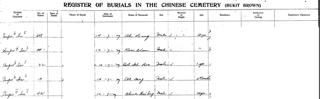
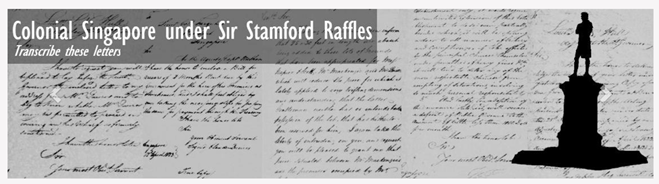
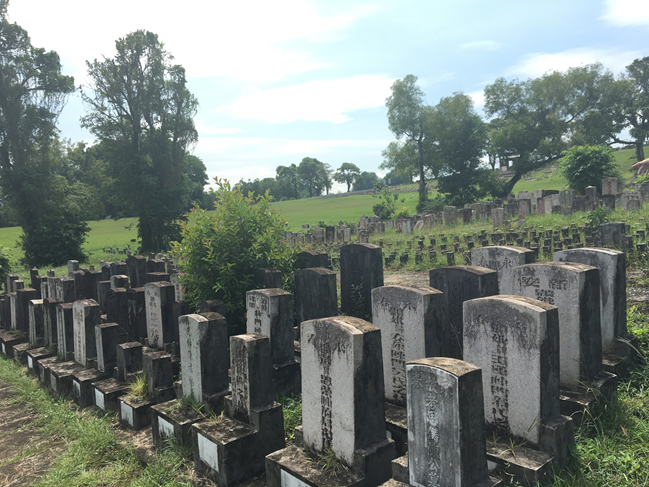
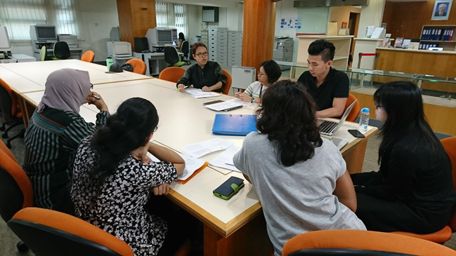
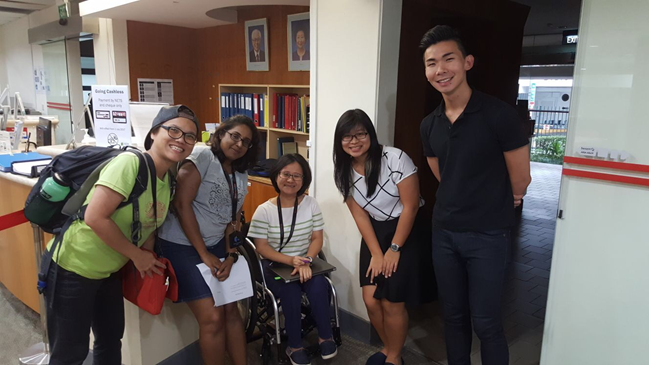

# Interns Reflections – Mandy Lee

Fiona Tan 2 years ago 4 min. read

Interns Reflections is a series of posts by our interns, recounting their experience with National Archives of Singapore. From deciphering manuscript handwriting, to poring over listings and records, to heading out into the field to conduct oral history interviews, our interns have the chance to go behind the scenes to see the multi-varied nature of archival work. Interested in joining us? Email us at nas@nlb.gov.sg!

Kickstarting our Interns Reflections series are our summer interns for 2017, Mandy Lee and [Lim Hui Xiang](http://www.nas.gov.sg/blogs/offtherecord/interns-reflections-lim-hui-xiang/).

# Interns Reflections

As part of my 10 weeks internship at National Archives of Singapore (NAS), I was given mainly two tasks. The first was to look through the various death-related records and organise the relevant materials into a help guide for researchers and NAS staff to refer to. The second task was to look through the Straits Settlement Records and source for any interesting Raffles-related documents and choose a few of the events to write short articles. I was really excited and looked forward to the new knowledge and skills I would gain through this meaningful internship.

 

​																						Figure 1

Figure 1 shows how a municipal’s burial register would look like. In particular, it was a Bukit Brown’s burial register, which includes details such as the deceased’s name, age, sex, nationality, address, cause of death, date of death and burial as well as the burial location, which includes the block and division. Looking at such burial registers was one of the many death-related records I had to look at in order to create the help guide. Apart from burial registers, I also looked at exhumation and cremation records, old Singapore maps, private records from Chinese clan associations and churches. Intitially, I was shocked at the great amount of information available in NAS and did not know what information to extract and highlight in the help guide. With the help of many in NAS, I managed to extract key points and include them in the help guide .

 

​																					Figure 2

Figure 2 shows the various handwritten letters written during British administration of the Straits Settlements from 1826 to 1946. Reading through the extensive collection of documents was yet another difficult task. Firstly, the cursive handwriting and poor condition of the documents made it hard for me to make sense of the documents. Secondly, there were many materials and I did not know where to start reading. Fortunately, the [help guide](http://www.nas.gov.sg/blogs/offtherecord/citizen-archivist-project-guide-to-transcribing-the-straits-settlements-records-by-nas-interns/) created by the previous NAS interns taught me how to identify certain words and provided me with many already transcribed letters that I could use in writing the articles.

 

​																					Figure 3

Apart from engaging in vigorous reading and researching, I also had the opportunity to explore Bukit Brown and Choa Chu Kang cemeteries with Ms Khoo Ee Hoon. It was an interesting experience as I was always afraid of visiting a cemetery due to the creepy aura it emits. However, through both fieldtrips, I realized that the cemeteries were actually very peaceful and unlike what I had previously imagined. Not only did I learn how to identify the various dialects groups through the different features of the tombstone, I also visited various prominent figures that were buried in these two cemeteries. Figure 3 is one example that shows a cluster of tombstones within the same family.

After the two fieldtrips, I was better able to understand the various death-related records in NAS. Rather than being depressed from the many death I’ve seen, I saw death as a part of life. I knew that the help guide would aid researchers in their research on family history or a broader social history in Singapore and became more keen to create a good help guide.

 

​																					Figure 4

Being an intern in NAS during this period also gave me the opportunity to participate in the annual children’s season programme at Former Ford Factory. Through this two days programme, I met colleagues from NAS Outreach department and got to interact with them. I also got to see how history could be infused into drama for younger children to understand and better appreciate. It was a wonderful experience and I loved it when I see that the young participants had great fun in the activities.

 

​																				Figure 5

On Week 10, it was time to present our findings and to show our completed help guide to the various NAS staff.  Figure 5 shows the ongoing discussion we had with NAS staff as well as Ms Ee Hoon. Excited and nervous, I wanted to hear the comments they had of the help guide. I was glad to hear positive feedbacks and felt that my 10 weeks of hard work was all worth it.

 

​																					Figure 6

With Figure 6, it marks the end of my internship with NAS. While it was a relative short period of time, these were the people who taught me various lifelong skills and knowledge. To conclude, I’ve learned how to better use the resources of NAS and I certainly look forward to coming back to NAS as a researcher.